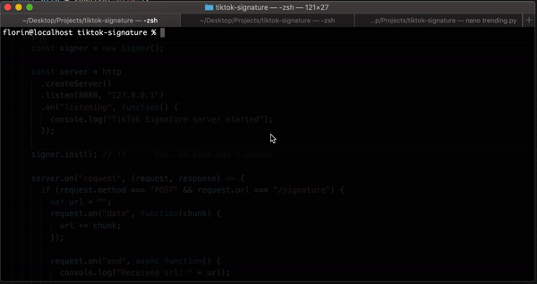

## Installation

```bash
npm i tiktok-signature
```

## Usage



### Generating signatures dynamically

To generate signatures dynamically this repo comes with an integrated http server (listen.js) which accepts POST requests to http://localhost:8080/signature with url in request body.

You have to start the server

```js
node listen.js
```
Request signature

```sh
curl -d "https://m.tiktok.com/share/item/list?secUid=&id=&type=5&count=30&minCursor=0&maxCursor=0&shareUid=" http://localhost:8080/signature
```


### Module

```js
const Signer = require("tiktok-signature"); // Import package
const signer = new Signer(); // Create new signer
await signer.init(); // Create page with. Returns promise
await signer.sign("tiktok url"); // Get sign for your url. Returns promise
await signer.close(); // Close browser. Returns promise
```

You can pass your desired User-Agent and tac on class creation.

```js
new Signer("Mozilla"); // Set User-Agent to Mozilla
new Signer(null, "123"); // Set tac to 123
```

### CLI

Install dependencies

```bash
npm i puppeteer puppeteer-extra puppeteer-extra-plugin-stealth
```

Now you can generate the token using

```bash
node browser.js "https://m.tiktok.com/api/item_list/?count=30&id=1&type=5&secUid=&maxCursor=1&minCursor=0&sourceType=12&appId=1233&verifyFp="
```

The response tokne should look like this

```sh
root@localhost: VIm6dAAgEBYZFjzZxqkSy1SJu2AAAlc
```

## Fetch service url

### Trending or VideoFeed

```
https://m.tiktok.com/api/item_list/?count=30&id=1&type=5&secUid=&maxCursor=1&minCursor=0&sourceType=12&appId=1233&verifyFp=
```

### Video feed

```
https://m.tiktok.com/node/video/feed
```

## Testing

You can test it using

```python
import requests

signature = "oKxAeAAgEBgX6bvJMQKua6CsQWAAP4r"

referer = "https://www.tiktok.com/@ondymikula/video/6757762109670477061"

url = "https://m.tiktok.com/api/item_list/?count=30&id=1&type=5&secUid=&maxCursor=1&minCursor=0&sourceType=12&appId=1233&verifyFp=" + \
    "&_signature=" + signature
request = requests.get(url, headers={"method": "GET",
                                "accept-encoding": "gzip, deflate, br",
                                "Referer": referer,
                                "user-agent": "Mozilla/5.0 (iPhone; CPU iPhone OS 11_0 like Mac OS X) AppleWebKit/604.1.38 (KHTML, like Gecko) Version/11.0 Mobile/15A372 Safari/604.1"
                                })
data = request.json()
print(data)
```

---

**NOTE**

It's very important that the userAgent be the same when generate and when request for response.

---

## Contributing

If you have a better improvement to this code, let me know ;)

Hope it helps.

## License

[MIT](https://choosealicense.com/licenses/mit/)
